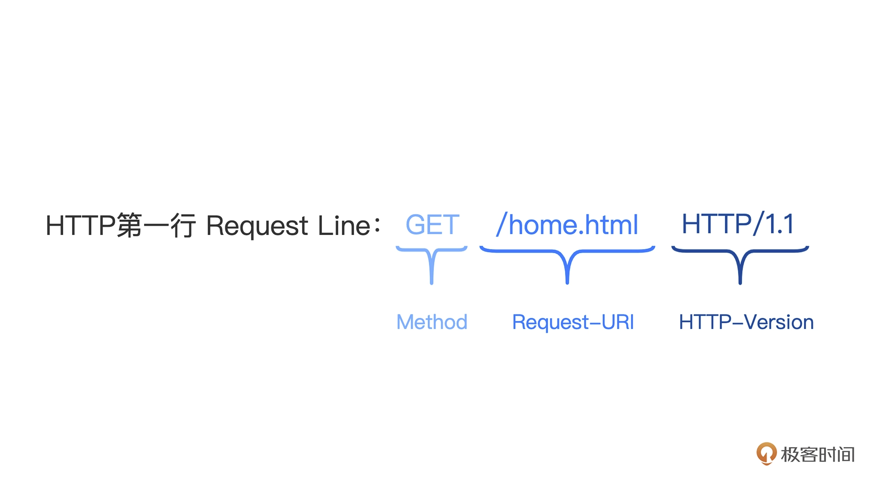
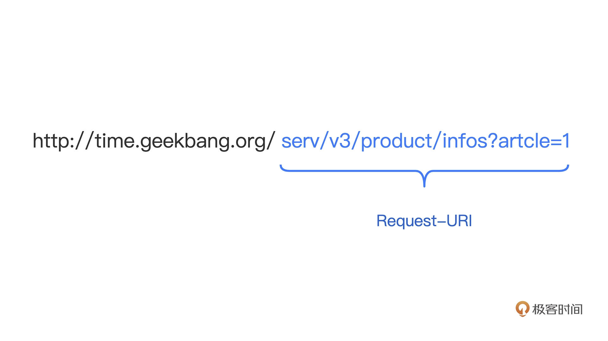
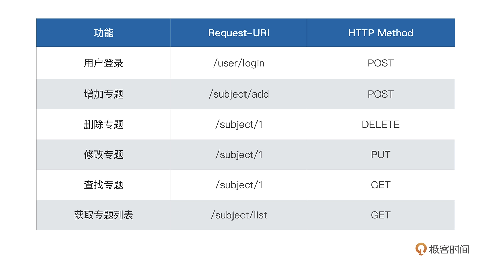

# 03

# 路由设计

## 路由设计思路

具体来说就是让 Web 服务器根据规则，理解 HTTP 请求中的信息，匹配查找出对应的控制器，再将请求传递给控制器执行业务逻辑，简单来说就是制定匹配规则

一个 HTTP 请求包含请求头和请求体。请求体内一般存放的是请求的业务数据，是基于具体控制业务需要的，所以，我们不会用来做路由

而请求头中存放的是和请求状态有关的信息，比如 User-Agent 代表的是请求的浏览器信息，Accept 代表的是支持返回的文本类型。以下是一个标准请求头的示例：

```

GET /home.html HTTP/1.1
Host: developer.mozilla.org
User-Agent: Mozilla/5.0 (Macintosh; Intel Mac OS X 10.9; rv:50.0) Gecko/20100101 Firefox/50.0
Accept: text/html,application/xhtml+xml,application/xml;q=0.9,*/*;q=0.8 
Accept-Language: en-US,en;q=0.5
Accept-Encoding: gzip, deflate, br
Referer: https://developer.mozilla.org/testpage.html
```

我们这里要关注的是 HTTP 请求的第一行，叫做 Request Line，由三个部分组成：Method、Request-URI 和 HTTP-Version（RFC2616）



Method 是 HTTP 的方法，标识对服务端资源的操作属性。它包含多个方法，每个方法都代表不同的操作属性。

```

       Method         = "OPTIONS"                ; Section 9.2
                      | "GET"                    ; Section 9.3
                      | "HEAD"                   ; Section 9.4
                      | "POST"                   ; Section 9.5
                      | "PUT"                    ; Section 9.6
                      | "DELETE"                 ; Section 9.7
                      | "TRACE"                  ; Section 9.8
                      | "CONNECT"                ; Section 9.9
                      | extension-method
       extension-method = token
```

Request-URI 是请求路径，也就是浏览器请求地址中域名外的剩余部分。



HTTP-Version 是 HTTP 的协议版本，目前常见的有 1.0、1.1、2.0

路由规则，是根据路由来查找控制器的逻辑，它本身就是一个框架需求。我们可以天马行空设想 100 条路由规则，并且全部实现它，也可以只设计 1、2 个最简单的路由规则。很多或者很少的路由规则，都不会根本性影响使用者，所以，并不是衡量一个框架好坏的标准。

## 路由规则的需求

我们说过希望使用者高效、易用地使用路由模块，基本需求可以有哪些呢？

### 需求 1：HTTP 方法匹配

早期的 WebService 比较简单，HTTP 请求体中的 Request Line 或许只会使用到 Request-URI 部分，但是随着 REST 风格 WebService 的流行，为了让 URI 更具可读性，在现在的路由输入中，HTTP Method 也是很重要的一部分了，所以，我们框架也需要支持多种 HTTP Method，比如 GET、POST、PUT、DELETE。

### 需求 2：静态路由匹配

静态路由匹配是一个路由的基本功能，指的是路由规则中没有可变参数，即路由规则地址是固定的，与 Request-URI 完全匹配。我们在第一讲中提到的 DefaultServerMux 这个路由器，从内部的 map 中直接根据 key 寻找 value ，这种查找路由的方式就是静态路由匹配

### 需求 3：批量通用前缀

因为业务模块的划分，我们会同时为某个业务模块注册一批路由，所以在路由注册过程中，为了路由的可读性，一般习惯统一定义这批路由的通用前缀。比如 /user/info、/user/login 都是以 /user 开头，很方便使用者了解页面所属模块。

所以如果路由有能力统一定义批量的通用前缀，那么在注册路由的过程中，会带来很大的便利。

### 需求 4：动态路由匹配

这个需求是针对需求 2 改进的，因为 URL 中某个字段或者某些字段并不是固定的，是按照一定规则（比如是数字）变化的。那么，我们希望路由也能够支持这个规则，将这个动态变化的路由 URL 匹配出来。所以我们需要，使用自己定义的路由来补充，只支持静态匹配的 DefaultServerMux 默认路由




#### 最终要实现的规则样式
```golang

package route
// 注册路由规则
func registerRouter(core *framework.Core) {
    // 需求1+2:HTTP方法+静态路由匹配
  core.Post("/user/login", UserLoginController)
    
    // 需求3:批量通用前缀
    subjectApi := core.Group("/subject")
  {
    subjectApi.Post("/add", SubjectAddController)
        // 需求4:动态路由
    subjectApi.Delete("/:id", SubjectDelController)
    subjectApi.Put("/:id", SubjectUpdateController)
    subjectApi.Get("/:id", SubjectGetController)
        subjectApi.Get("/list/all", SubjectListController)
  }  
}
```
